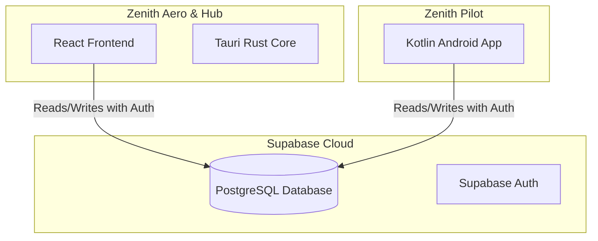

# Zenith Ecosystem - Architecture Guide

Welcome to the general architecture guide for the **Zenith** ecosystem. Zenith is an intelligent platform for athletes and cyclists to plan routes, analyze training, log strength sessions, monitor health metrics, and receive live coaching.

---

## 1. Components of the Ecosystem

The Zenith ecosystem consists of modular applications that communicate seamlessly via a central cloud database:

### 🚀 Zenith Aero (Desktop & Web App)
* **Location in monorepo**: `apps/zenith-aero`
* **Tech Stack**: React + TypeScript + Vite + Tauri (desktop wrapper).
* **Role**: 
  - **Route Planner**: Generates wind-adjusted and elevation-focused training routes based on targets and weather forecasts.
  - **Coach Panel**: Analyzes rides, manages the physiological PMC (Performance Management Chart) simulation, and generates personalized workouts.
  - **Calendar**: Schedules workouts and training plans.

### 🚴 Zenith Pilot (Android App)
* **Location in monorepo**: `apps/zenith-pilot`
* **Tech Stack**: Kotlin + Jetpack Compose + Ktor + Supabase Kotlin SDK.
* **Role**:
  - **Bike Computer**: Mounted on handlebars. Displays real-time metrics (speed, power, heart rate, cadence).
  - **Sensor Pairing**: Connects directly to BLE sensors (heart rate straps, power meters, cadence sensors).
  - **Audio Coach**: Delivers live in-ear audio guidance based on active interval workouts and route targets.

---

## 2. Data Synchronization & Cloud Architecture

Applications are connected via a shared **Supabase** instance in the cloud.

### Data Flow
1. **Planning**: The user generates or selects a workout and route in **Aero**. This is stored in the `planned_workouts` table (referencing `routes`).
2. **Synchronization**: **Pilot** fetches today's planned workouts from `planned_workouts` and loads corresponding route points from `routes` for navigation and coaching.
3. **Recording**: During the ride, **Pilot** records sensor data and GPS locations. After finishing, the activity is uploaded to `rides`.
4. **Analysis**: **Aero** detects the new ride in `rides`, calculates actual TSS (Training Stress Score), and updates the PMC chart (Fitness, Fatigue, Form).

---

## 3. Shared Configuration Guidelines (Single Source of Truth)

To ensure all present and future apps within the ecosystem communicate seamlessly, we utilize central configurations in the `/shared` directory:

### 🔑 Database Connection (`shared/supabase-config.json`)
Contains `supabaseUrl` and `supabaseAnonKey`.
* **Aero** loads this during build time via `.env` configuration.
* **Pilot** loads this via Gradle build properties.

### 🎨 Styling and Theme (`shared/design-tokens.json`)
Specifies universal styling tokens (colors, typography, spacing, and shapes) for the Zenith brand.

---

## 4. Local Distribution & QR Sync

Aero features a built-in **Zenith Hub** panel:
* **Goal**: Download the Pilot Android APK directly to mobile devices on the local network.
* **Operation**: Aero starts a local HTTP server (port `1420`). The local IP address is retrieved via a Tauri command (`get_local_ip`). A QR code links to `http://<local-ip>:1420/app-debug.apk` for instant installation.
